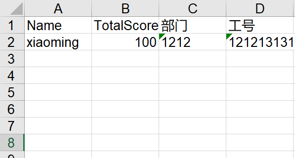

# WeihanLi.Npoi 支持 `ShadowProperty` 了

## Intro

在 EF 里有个 `ShadowProperty` (阴影属性/影子属性)的概念，你可以通过 FluentAPI 的方式来定义一个不在 .NET model 里定义的属性，只能通过 EF 里的 `Change Tracker` 来操作这种属性。

在导出 Excel 的时候，可能希望导出的列并不是都定义好在我们的 model 中的，有的可能只是想增加一列导出某个属性中的嵌套属性之中的某一个属性值，或者我就是单纯的想多定义一列，而这个时候可能 model 是别的地方写死的，不方便改。

于是 `WeihanLi.Npoi` 从 1.6.0 版本开始支持 `ShadowProperty` ，将  EF 里的 `ShadowProperty` 引入到 excel 导出里，目前来说 `ShadowProperty` 是不可写的，读取的话也只是返回一个类型的默认值，不支持 `ChangeTracker`，不支持改。

## 使用示例

来看一个简单使用示例：(示例来源于网友提出的这个issue： <https://github.com/WeihanLi/WeihanLi.Npoi/issues/51>)

``` csharp
using System;
using System.Collections.Generic;
using System.IO;
using WeihanLi.Npoi;

namespace NpoiTest
{
    public class Program
    {
        public static void Main(string[] args)
        {
            var settings = FluentSettings.For<TestEntity>();
            settings.Property(x => x.Name)
                .HasColumnIndex(0);
            // settings.Property(x => x.UserFields)
            //     .HasOutputFormatter((entity, value) => $"{value[0].Value},{value[2].Value}")
            //     .HasColumnTitle("姓名,工号")
            //     .HasColumnIndex(1);
            settings.Property(x=>x.UserFields).Ignored();
            settings.Property("工号")
                .HasOutputFormatter((entity,val)=> $"{entity.UserFields[2].Value}")
                 ;
            settings.Property("部门")
                .HasOutputFormatter((entity,val)=> $"{entity.UserFields[1].Value}")
                 ;

            var data = new List<TestEntity>()
            {
                new TestEntity()
                {
                    Name = "xiaoming",
                    TotalScore = 100,
                    UserFields = new UserField[]
                    {
                        new UserField()
                        {
                            Name = "姓名",
                            Value = "xaioming",
                        },
                        new UserField()
                        {
                            Name = "部门",
                            Value = "1212"
                        },
                        new UserField()
                        {
                            Name = "工号",
                            Value = "121213131"
                        },
                    }
                }
            };
            data.ToExcelFile($@"{Directory.GetCurrentDirectory()}\output.xls");
            Console.WriteLine("complete.");
        }

        private class TestEntity
        {
            public string Name { get; set; }

            public UserField[] UserFields { get; set; }

            public int TotalScore { get; set; }
        }

        private class UserField
        {
            public string Fid { get; set; }
            public string Name { get; set; }
            public string Value { get; set; }
        }
    }
}
```

导出效果如下：



可以看到，我们为导出的 Excel 增加在原本的 Model 里没有定义的两列，借助于此，我们可以更灵活的定制要导出的内容
