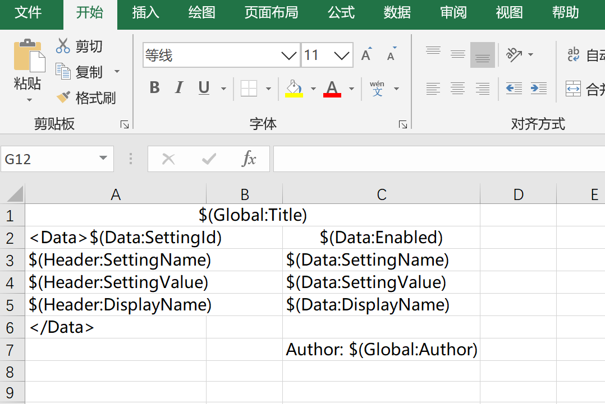
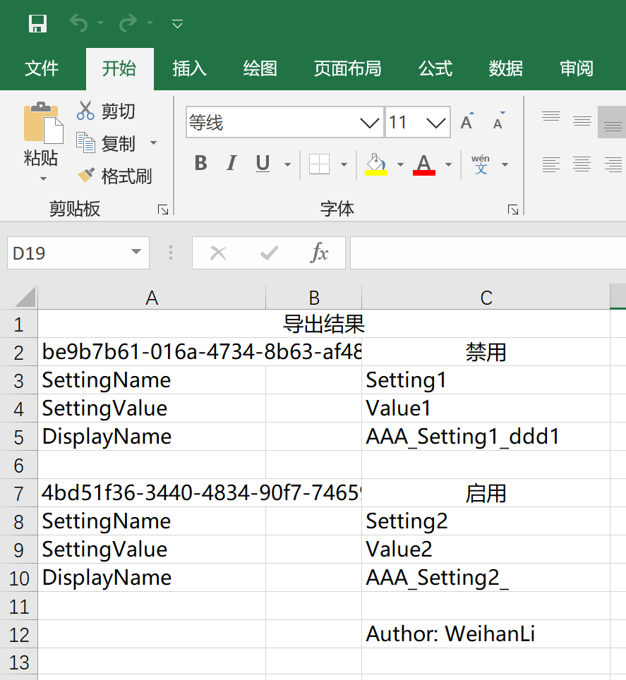

# 根据模板导出Excel

## Intro

原来的导出方式比较适用于比较简单的导出，每一条数据在一行，数据列虽然自定义程度比较高，如果要一条数据对应多行就做不到了，于是就想支持根据模板导出，在 1.8.0 版本中引入了根据模板导出的功能

## 使用示例

### 示例模板



模板规划的可以有三种数据：

- Global：一个是导出的时候可以指定一些参数，作为 Global 参数，默认参数格式使用: `$(Global:PropName)` 的格式
- Header：配置的对应属性的显示名称，默认是属性名称，默认参数格式：`$(Header:PropName)`
- Data：对应数据的属性值，默认参数格式：`$(Data:PropName)`


默认模板参数格式（从 1.8.2 版本开始支持通过 `TemplateHelper.ConfigureTemplateOptions` 方法来自定义）：

- Global 参数：`$(Global:{0})`
- Header 参数：`$(Header:{0})`
- Data 参数：`$(Data:{0})`
- Data Begin: `<Data>`
- Data End: `</Data>`


模板规范：

模板需要通过 Data Begin 和 Data End 来配置数据模板的开始和结束以识别每一个数据对应的开始行和结束行


### 示例代码

示例配置

``` csharp
var setting = ExcelHelper.SettingFor<TestEntity>();
// ExcelSetting
setting.HasAuthor("WeihanLi")
    .HasTitle("WeihanLi.Npoi test")
    .HasDescription("WeihanLi.Npoi test")
    .HasSubject("WeihanLi.Npoi test");

setting.HasSheetConfiguration(0, "SystemSettingsList", 1, true);

setting.Property(_ => _.SettingId)
    .HasColumnIndex(0);

setting.Property(_ => _.SettingName)
    .HasColumnTitle("SettingName")
    .HasColumnIndex(1);

setting.Property(_ => _.DisplayName)
    .HasOutputFormatter((entity, displayName) => $"AAA_{entity.SettingName}_{displayName}")
    .HasInputFormatter((entity, originVal) => originVal.Split(new[] { '_' })[2])
    .HasColumnTitle("DisplayName")
    .HasColumnIndex(2);

setting.Property(_ => _.SettingValue)
    .HasColumnTitle("SettingValue")
    .HasColumnIndex(3);

setting.Property(x => x.Enabled)
    .HasColumnInputFormatter(val => "启用".Equals(val))
    .HasColumnOutputFormatter(v => v ? "启用" : "禁用");

setting.Property("HiddenProp")
    .HasOutputFormatter((entity, val) => $"HiddenProp_{entity.PKID}");

setting.Property(_ => _.PKID).Ignored();
setting.Property(_ => _.UpdatedBy).Ignored();
setting.Property(_ => _.UpdatedTime).Ignored();
```

根据模板导出示例代码：

``` csharp
var entities = new List<TestEntity>()
{
    new TestEntity()
    {
        PKID = 1,
        SettingId = Guid.NewGuid(),
        SettingName = "Setting1",
        SettingValue = "Value1",
        DisplayName = "ddd1"
    },
    new TestEntity()
    {
        PKID=2,
        SettingId = Guid.NewGuid(),
        SettingName = "Setting2",
        SettingValue = "Value2",
        Enabled = true
    },
};
var csvFilePath = $@"{tempDirPath}\test.csv";
entities.ToExcelFileByTemplate(
    Path.Combine(ApplicationHelper.AppRoot, "Templates", "testTemplate.xlsx"),
    ApplicationHelper.MapPath("templateTestEntities.xlsx"),
    extraData: new
    {
        Author = "WeihanLi",
        Title = "导出结果"
    }
);
```

### 导出结果




## More

为了方便使用，增加了一些方便的扩展方法：

``` csharp
public static int ToExcelFileByTemplate<TEntity>([NotNull]this IEnumerable<TEntity> entities, string templatePath, string excelPath, int sheetIndex = 0, object extraData = null);

public static int ToExcelFileByTemplate<TEntity>([NotNull]this IEnumerable<TEntity> entities, byte[] templateBytes, string excelPath, ExcelFormat excelFormat = ExcelFormat.Xls, int sheetIndex = 0, object extraData = null);

public static int ToExcelFileByTemplate<TEntity>([NotNull]this IEnumerable<TEntity> entities, IWorkbook templateWorkbook, string excelPath, int sheetIndex = 0, object extraData = null);

public static byte[] ToExcelBytesByTemplate<TEntity>([NotNull]this IEnumerable<TEntity> entities, string templatePath, int sheetIndex = 0, object extraData = null);

public static byte[] ToExcelBytesByTemplate<TEntity>([NotNull]this IEnumerable<TEntity> entities, byte[] templateBytes, ExcelFormat excelFormat = ExcelFormat.Xls, int sheetIndex = 0, object extraData = null);

public static byte[] ToExcelBytesByTemplate<TEntity>([NotNull]this IEnumerable<TEntity> entities, Stream templateStream, ExcelFormat excelFormat = ExcelFormat.Xls, int sheetIndex = 0, object extraData = null);

public static byte[] ToExcelBytesByTemplate<TEntity>([NotNull]this IEnumerable<TEntity> entities, IWorkbook templateWorkbook, int sheetIndex = 0, object extraData = null);

public static byte[] ToExcelBytesByTemplate<TEntity>([NotNull]this IEnumerable<TEntity> entities, ISheet templateSheet, object extraData = null);

```


## Reference

- <https://github.com/WeihanLi/WeihanLi.Npoi>
- <https://github.com/WeihanLi/WeihanLi.Npoi/blob/917e8fb798e9cbae52d121a7d593e37639870911/samples/DotNetCoreSample/Program.cs#L94>